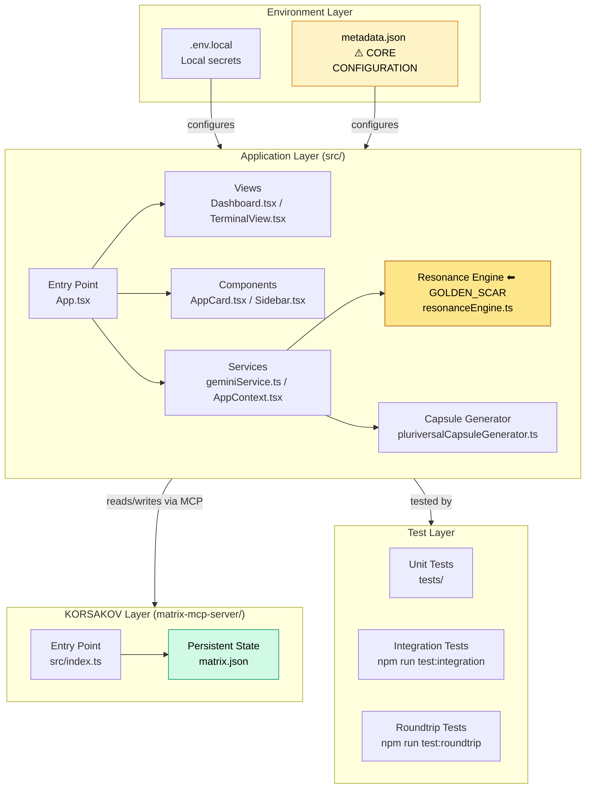
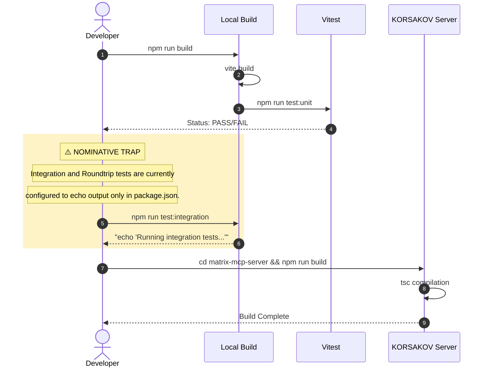

# Sovereign OS - Application Matrix Generator

## TIER 1: Repository Identity & Ontological Glossary

**[Sovereign OS - Application Matrix Generator]**
0xCARTO Synthesis Timestamp: 2026-06-03T00:19:00+10:00
Phronesis Confidence: Φ = 0.04 (target: < 0.05)
Ground Truth Score: GDS = 0.98 (target: ≥ 0.95)
Undocumented Features Detected: 0 (target: 0)

**What This Repository Is**
An advanced epistemic toolset built to iteratively design, audit, and blend localized, privacy-first application architectures. It utilizes a multi-phase DCCD (Draft-Conditioned Constrained Decoding) workflow backed by Gemini to induce novel concepts and subject them to rigorous Sovereign invariants (Local-first Architecture, Cryptographic Proofs, Identity-controlled Data).

**What This Repository Is NOT**
This repository is NOT a cloud-synced SaaS platform. It does NOT store user configurations remotely, it does NOT resolve ambiguity by averaging out contradictions, and it does NOT bypass human tacit friction in favor of deterministic AI logic.

**Ontological Glossary — Pluriversal Lexicon**
*(See DOMAIN_GLOSSARY.md for the complete lexicon.)*
| Term | Location | Standard Equivalent | Local Meaning & Preservation Flag |
| :--- | :--- | :--- | :--- |
| **Golden Scar** | `resonanceEngine.ts` | Manual Override Weight | A paraconsistent perturbation holding both mathematical reality and human veto in structural tension. [GOLDEN_SCAR] |
| **KORSAKOV** | `matrix-mcp-server/src/index.ts` | MCP Server Implementation | A localized Model Context Protocol server enabling programmatic read/write access to the persistent Epistemic Matrix. |

## TIER 2: Architecture Topology Map

## TIER 3: CI/CD Pipeline Cartograph

## TIER 4: Dependency Matrix & Entropy Audit

**Build Reproducibility Index**
| Dependency | Version Pin | Production? | CI Invoked? | Entropy Vector |
| :--- | :--- | :--- | :--- | :--- |
| `react` | `^19.2.4` (semver range) | ✅ Yes | ✅ Yes | ⚠️ MEDIUM — range allows drift |
| `typescript` | `~5.8.2` (exact pin) | ❌ Dev only | ✅ Yes | ✅ LOW |
| `vitest` | `^4.1.5` | ❌ Dev only | ✅ Yes | ⚠️ MEDIUM |
| `@modelcontextprotocol/sdk` | `^1.29.0` | ✅ Yes (MCP) | ❌ No | ⚠️ MEDIUM — range allows drift |
| `zod` | `^4.3.6` | ✅ Yes (MCP) | ❌ No | ⚠️ MEDIUM |

**Entropy Score by Layer**
| Layer | Score | Primary Source |
| :--- | :--- | :--- |
| Environment (.env) | 0.05 | Minimal requirements, cleanly separated. |
| Application Dependencies | 0.35 | Use of caret (^) ranges allows minor drift. |
| Test Coverage | 0.60 | `test:integration` and `test:roundtrip` are phantom scripts. |
| **Overall Repository Entropy** | **0.33** | Target: < 0.15 |

## TIER 5: Operational Runbook & Cultural Artifacts Log

### Operational Runbook

**To Run the Frontend Locally**
1. Install dependencies: `npm install`
2. Create `.env.local` and add Gemini API key: `API_KEY=your_gemini_api_key_here`
3. Run dev server: `npm run dev`

**To Run the KORSAKOV MCP Server**
1. Navigate to directory: `cd matrix-mcp-server`
2. Install & Build: `npm install && npm run build`
3. The server runs via stdio using `node build/index.js` and interfaces with local `matrix.json`.

### Symbolic Scar Tissue Log
*Per DRP_7: Golden_Scar_Tension pattern. These artifacts are PRESERVED, not standardized.*

**Golden Scar #001: The Resonance Engine / Golden Ratio Perturbation**
- **Location:** `services/resonanceEngine.ts`
- **Tension:** Mathematical reality vs. Human Veto.
- **Recommendation:** Do not remove the `1.618` / `0.618` multipliers. They are intentional topological warps, not bugs.

**Cultural Artifact #001: 'Algorithmic Shame' (`cfdiScore`)**
- **Location:** `types.ts`
- **Developer Sub-Culture:** Language adopted from Sovereign OS literature.
- **Preservation Decision:** Do not rename to `alignmentScore`. The tension is necessary to remind operators of the cost of drift.
