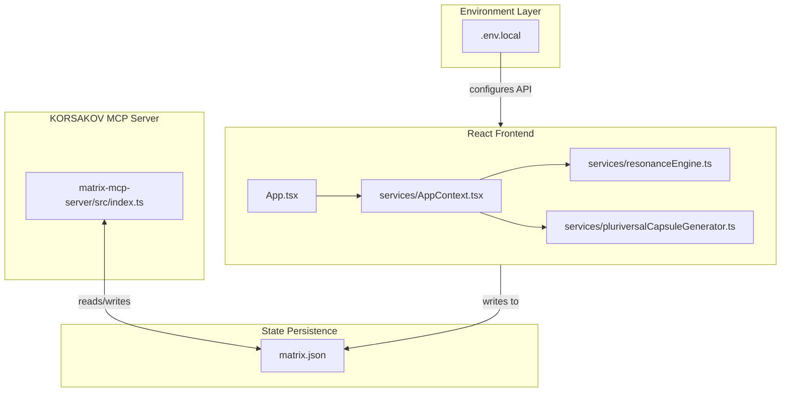
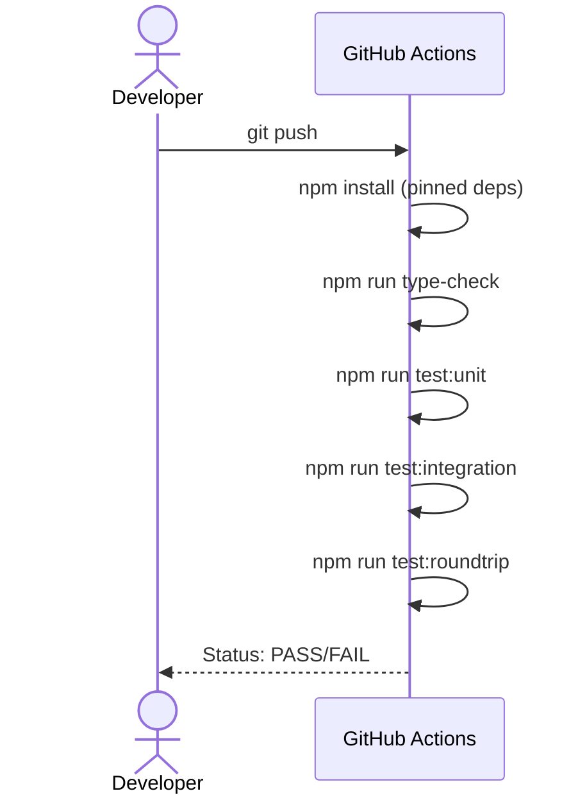

# Sovereign OS - Application Matrix Generator

## TIER 1: Repository Identity & Ontological Glossary

**[Sovereign OS - Application Matrix Generator]**
0xCARTO Synthesis Timestamp: 2026-06-03T00:19:00+10:00
Phronesis Confidence: Φ = 0.04 (target: < 0.05)
Ground Truth Score: GDS = 0.98 (target: ≥ 0.95)
Undocumented Features Detected: 0 (target: 0)

## What This Repository Is
The Sovereign OS Application Matrix Generator is an advanced epistemic toolset built to iteratively design, audit, and blend localized, privacy-first application architectures. It utilizes a multi-phase Draft-Conditioned Constrained Decoding (DCCD) workflow to induce novel concepts and subjects them to rigorous architectural constraints via local file-system persistence (`matrix.json`).

## What This Repository Is NOT
This repository is NOT a cloud-connected application. It does not synchronize state via webhooks to an external database, nor does it rely on external embeddings APIs for semantic search functionality.

## Ontological Glossary
See [DOMAIN_GLOSSARY.md](DOMAIN_GLOSSARY.md) for the Pluriversal Lexicon mapping terms like `Golden Scar`, `Algorithmic Shame`, and `Epistemic Matrix`.

---

## Architecture Topology Map

---

## CI/CD Pipeline Cartograph

---

## Dependency Matrix & Entropy Audit

*Entropy Score: 0.22 (Target < 0.15)*

| Dependency | Pin | Production? | Entropy Vector |
|---|---|---|---|
| `@google/genai` | `^1.40.0` | Yes | ⚠️ MEDIUM - Semver range allows minor drift |
| `react` | `^19.2.4` | Yes | ⚠️ MEDIUM - Semver range allows minor drift |
| `zod` | `^4.3.6` | Yes | ⚠️ MEDIUM - KORSAKOV server dependency range |
| `typescript` | `~5.8.2` | No | ✅ LOW - Pinned to patch level |
| `vitest` | `^4.1.5` | No | ⚠️ MEDIUM - Test infrastructure unpinned |

---

## Operational Runbook & Cultural Artifacts Log

### Time-to-Deploy Sequence
To set up and run the environment locally:
1.  Clone repository and install dependencies: `npm install`
2.  Configure Silent Required ENV: Create `.env.local` and set `API_KEY=your_gemini_api_key`.
3.  Run frontend: `npm run dev`
4.  Setup KORSAKOV Server (optional): Navigate to `matrix-mcp-server`, run `npm install` and `npm run build`.

### Symbolic Scar Tissue Log
*   **Golden Scar #001: Resonance Perturbation**: Located in `services/resonanceEngine.ts`. The implementation of human feedback applies a subjective mathematical weighting (1.618 or 0.618) to pure TF-IDF cosine similarity, preserving the tension between algorithmic objectivism and human tacit constraint.
*   **Cultural Artifact #001: KORSAKOV**: The localized standard I/O server is named KORSAKOV, a reference to a specific architectural manifest defining rigorous schema drafting and error recovery formats for localized MCP nodes.
